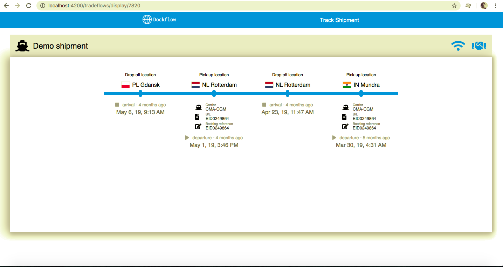
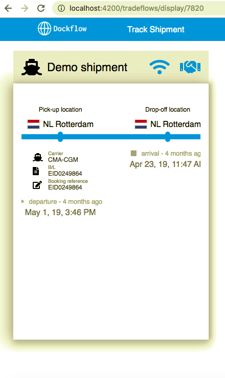
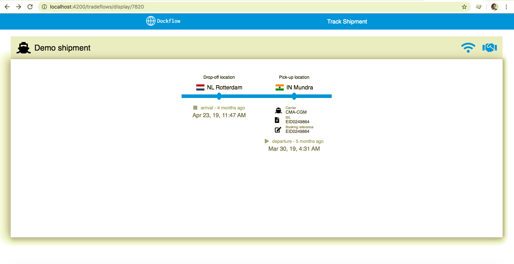
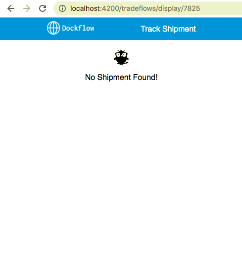

# Shipment

This project was generated with [Angular CLI](https://github.com/angular/angular-cli) version 7.3.9.

## Development server

Run `ng serve` for a dev server. Navigate to `http://localhost:4200/`. The app will automatically reload if you change any of the source files.

## Highlights

1. shared folder contains utility functions and dummy.json. The dummy json can be replaced / extended with a service in the prod version.

2. A separate variables.scss for colors and fonts.

3. The timeline is set to `overflow-x: auto` so it automatically scrolls in the horizontal direction. Works in mobile resolutions as well. Test by resizing browser.

4. The status updates on the timeline are rendered reverse so the latest status appears on the left. The user doesn't need to scroll to the right to know the current status.

5. The timeline automatically adjusts to the number to status updates. Test by adding / removing entries from the `sea_movements` object in the json.

6. Clicking on `Track Shipment` in the header takes to the tracking page. The route is configured to accept the tracking ID.

7. If the shipment ID is not found, an error page is also thrown. Try giving some random number in the url.

## Code scaffolding

Run `ng generate component component-name` to generate a new component. You can also use `ng generate directive|pipe|service|class|guard|interface|enum|module`.

## Build

Run `ng build` to build the project. The build artifacts will be stored in the `dist/` directory. Use the `--prod` flag for a production build.

## Running unit tests

Run `ng test` to execute the unit tests via [Karma](https://karma-runner.github.io).

## Running end-to-end tests

Run `ng e2e` to execute the end-to-end tests via [Protractor](http://www.protractortest.org/).

## Further help

To get more help on the Angular CLI use `ng help` or go check out the [Angular CLI README](https://github.com/angular/angular-cli/blob/master/README.md).
